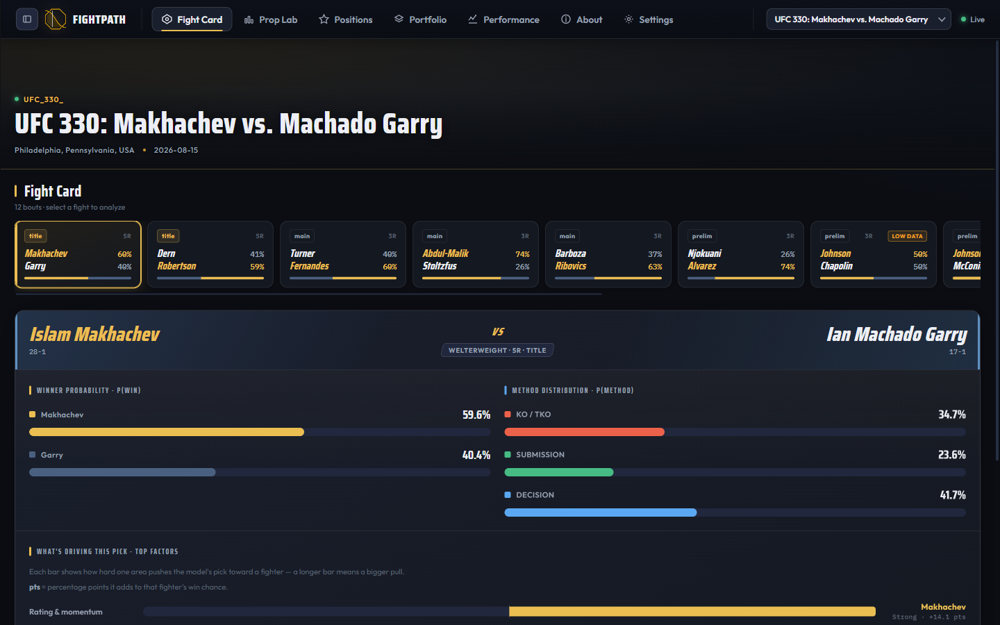
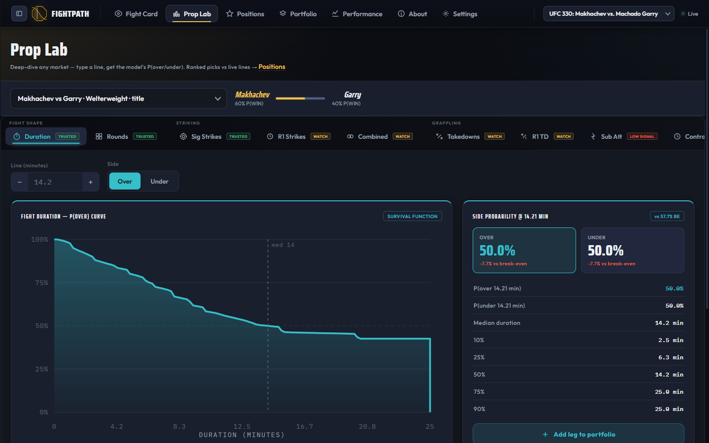
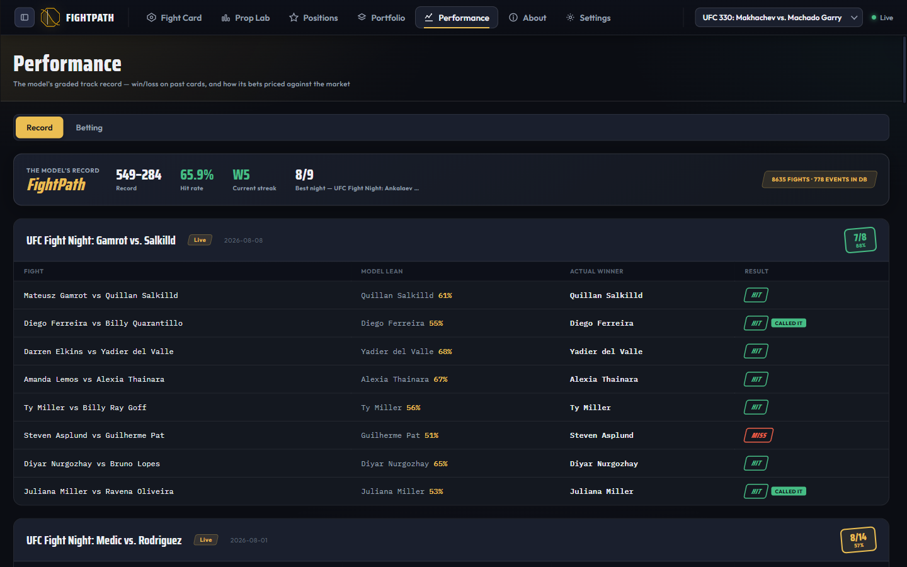

<div align="center">


# FightPath

**A calibrated probabilistic forecasting engine for UFC fights.**

**66.5% winner accuracy** on a held-out temporal split, at a calibration error
of **0.041** — plus how the fight ends, how long it lasts, and how many strikes
land, as full probability distributions rather than point guesses.

[**Live demo**](https://fight-path-ml.vercel.app) · [Results](#results--the-four-gates) · [Forward evaluation](#forward-evaluation-not-backtest-theatre) · [Architecture](#architecture)

</div>

> **Research project, not betting advice.** Independent work, not affiliated
> with or endorsed by the UFC. Please read [DISCLAIMER.md](DISCLAIMER.md).

---

## The problem

Fight prediction is a genuinely hard forecasting problem, and most of what
makes it hard is invisible from the outside:

- **Tiny per-fighter samples.** A veteran has 15 UFC fights. Many have three.
  Debutants have zero — and the model must still produce a number.
- **Heavy-tailed outcomes.** A fight is a survival process with competing
  risks (KO, submission, decision) that can terminate at any second. Averages
  are close to meaningless.
- **Severe regime drift.** Rules, judging, divisions, and the athlete pool all
  move. A model fit on 2010 fights is measuring a different sport.
- **Leakage is everywhere.** Career averages, rating systems, and rolling
  windows all quietly encode the result of the fight you are trying to predict
  unless every feature is built strictly from pre-fight state.

Two things follow. First, accuracy alone is a weak claim — it is easy to
inflate with a leaky feature or a lucky split, which is why this project fixes
its temporal split in config and re-runs the same gates on every change.
Second, the harder and more useful target is **calibration**: a model that says
70% should win close to 70% of the time. An accurate model tells you who to
watch; a calibrated one tells you how much to believe it.

FightPath is built to hit both, and to prove it on data it has never seen.

## Results — the four gates

Development is governed by four pre-registered gates with fixed thresholds.
They are the **only** optimization targets; new objectives are not invented
mid-flight to make a result look better.

Evaluated on the **EVAL tier** — a locked temporal split (train ≤2023,
validate 2024, test 2025–26) that never sees the test years. Numbers below are
one coherent run (`INJ-4`, 2026-07-17), not a best-of assembled across runs.

| Gate | Measures | Threshold | Result | |
|---|---|---|---|---|
| **A** Winner | Accuracy | ≥ 0.64 | **0.6654** | ✅ |
| | Brier score | ≤ 0.225 | **0.2226** | ✅ |
| | Calibration error (ECE) | ≤ 0.05 | **0.0407** | ✅ |
| **B** Props | Per-prop PIT-KS + CRPS skill | p > 0.05 | 5/11 | ⚠️ |
| **C** Method | KO/TKO Brier skill score | ≥ 0.02 | **0.0672** | ✅ |
| | Method ECE (CI-lower) | ≤ 0.05 | within CI | ✅ |
| **D** Joint coherence | Contradictions across heads | 0 violations | **0** | ✅ |

**66.5% winner accuracy at an ECE of 0.041** — the model is not only accurate,
it is *honest*: when it says 70%, it wins close to 70% of the time. Calibration
is the harder half of that sentence and the one most fight models skip.

Gate B is a distribution-shape test across 11 prop markets, held to a
deliberately strict standard: a prop passes only if its full predicted
distribution survives a Kolmogorov–Smirnov test, not merely if its mean is
close. `r1_sig_strikes` carries a documented structural exemption — round-1
counts are bimodal, because a fight either ends in round 1 or doesn't, and one
marginal distribution cannot fit both modes.

**Gate D** is the one I would point at first. It checks that the heads don't
contradict each other — that P(KO) and the strike-count distribution and the
fight-duration curve describe the *same* fight. Independently accurate heads
that jointly imply nonsense are a failure mode most pipelines never test for.

## Forward evaluation, not backtest theatre

A backtest is a claim. A forward-graded log is evidence — so the system is
built to hold itself to the second standard.

Every prediction is written to a ledger **before the fight happens**, with a
timestamp, and graded automatically once results land. Nothing is scored
against data it could have peeked at, and no number in the live record was
produced by re-running a model over an outcome it already knew.

**Live graded record: 549–284 — 65.9% across 833 graded predictions**, drawn
from a database of 8,635 fights over 778 events. That tracks the 66.5%
measured offline on the held-out split, which is exactly what you want to see:
the forward record and the held-out evaluation agreeing to within a point.

The same discipline extends to market comparison. Scheduled jobs capture
**closing lines** for every logged position and grade each one against the
market's final price, so model probabilities can be scored with a proper
forecasting metric (closing-line value) rather than raw win/loss — which is
mostly noise at these sample sizes. That machinery is part of the repository:

- `scripts/07_log_predictions.py` — pre-fight prediction ledger
- `scripts/07c_capture_closing_lines.py` — closing-line capture
- `scripts/08_grade_predictions.py` / `08b_grade_props.py` — automated grading
- `scripts/08c_report_prop_ledger.py` — forward scorecard

Calibration, coherence, and forward grading are the three things that make a
probabilistic model trustworthy, and each one is measured here rather than
asserted.

## What it looks like

| | |
|---|---|
|  |  |
| **Fight card** — per-bout win probability, method split, and the top drivers behind each pick | **Prop Lab** — full survival curve and quantiles for any market and line |



**Performance** — every prediction is logged *before* the fight and graded
after, so the live record is a forward test rather than a backfit.

## Architecture

```
ufcstats.com ──► ingest ──► feature build ──► two model tiers ──► gates A–D
                    │            │                   │
              typed parquet  leakage-guarded    EVAL (locked split)
                             temporal windows   PROD (rolling, served)
                                                       │
Kalshi public API ──► market baseline ──► FastAPI ──► React/Vite UI
```

**Two-tier model split.** The tension: the served model should train on *all*
data through the latest card, but a model trained on everything has no honest
test set. So there are two tiers from one codebase, selected at runtime:

- **EVAL** — locked split, never sees 2025–26. The honest yardstick. Gates run here.
- **PROD** — rolling split, trains through the latest card. This is what gets served.

Any accuracy figure shown to a user comes from the EVAL tier. Scoring the PROD
tier on data it memorized would be self-flattery, and this separation exists
specifically to make that mistake impossible rather than merely discouraged.

**Model heads**

| Head | Approach | Output |
|---|---|---|
| Winner | Gradient-boosted ensemble + Platt/temporal-OOF calibration | P(win) |
| Method | Two-stage: P(finish), then P(KO \| finish) | KO / SUB / DEC |
| Duration | Method-conditional quantile models → mixture CDF | Full survival curve |
| Props | Count distributions per market | CDF per line |

Prop markets are priced by Monte Carlo over the joint outcome so that
correlations survive — strike counts conditioned on the fight actually
reaching that round, not marginal averages multiplied together.

**Ratings.** Elo, Glicko, and TrueSkill are maintained per fighter with
pre-fight state reconstructed as of each bout, so no rating ever encodes the
result of the fight it is used to predict.

## Engineering notes

- **Leakage is treated as the primary threat.** Features are built from strictly
  pre-fight windows; `tests/test_windows_noleak.py` asserts it, and a dedicated
  review pass runs over any diff touching feature or training code. The
  project's largest single accuracy correction came from finding a
  label-proxy leak, not from a better model.
- **Reproducible splits.** Temporal splits live in version-controlled config,
  not in notebook cells.
- **350 tests**, green on a fresh clone. Tests needing the (undistributed)
  dataset skip cleanly rather than failing.
- **Run log.** [`RUNS.md`](RUNS.md) records every change against its gate
  results, including reverts. The standing rule is: add one complexity at a
  time, re-run the gates, and **revert on regression** — several entries are
  changes that seemed good and were backed out on the numbers.
- **Research notes** in [`docs/notes/`](docs/notes/) document investigations,
  including the ones that concluded "no effect."

## Stack

Python 3.12 · scikit-learn · LightGBM / XGBoost / CatBoost · TrueSkill ·
pandas / pyarrow · SciPy · FastAPI · React 18 + Vite · Vercel · pytest

## Running it

```bash
git clone https://github.com/bsgelman/FightPath.git
cd FightPath
pip install -r requirements.txt
pip install -e .          # puts `ufc` on the path
pytest -q                 # green without any dataset
```

The repository ships **no trained weights and no scraped dataset** — see
[DATA.md](DATA.md) for why, the provenance of each source, and the commands to
rebuild the dataset and retrain from scratch.

```bash
uvicorn ufc.api.app:app --reload --port 8000   # API
cd frontend && npm install && npm run dev      # UI
```

## Known boundaries

Stated up front, because knowing where a model stops working is part of
knowing what it is worth:

- **Debutants.** With no professional history there is little to condition on,
  so the model falls back to priors. These fights are flagged in the UI rather
  than quietly served at full confidence.
- **Round-1 prop distributions** are bimodal by construction (see Gate B) and
  carry a pre-registered structural exemption.
- **Fight-night information is out of scope** — weight-cut trouble, undisclosed
  injuries, camp changes. A meaningful share of residual error lives here, and
  it is the most promising direction for the next version.

## License

[Apache-2.0](LICENSE). Trained model weights and datasets are **not** included
and **not** licensed — see [NOTICE](NOTICE).
